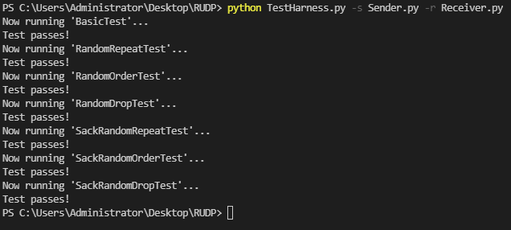
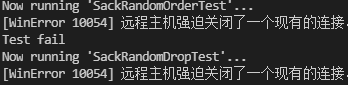

# Reliable UDP

+ Platform : windows
+ python : 3.10.1
+ Go-back-n protocol & SR protocol

## Test

6 test cases in total

## Supplement

+ There is a chance of running into this problem before the test starts .
+ After one end (either the client or the server) closes the Socket, the other end is still receiving the Socket.
+  It may be a framework problem  .

